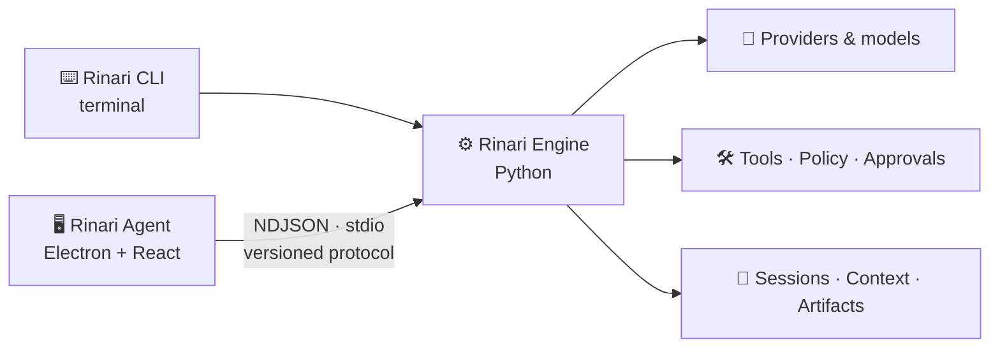

<a href="https://xainner.com">
  
</a>

<div align="center">

[](https://xainner.com)
[](https://rinari.ai)
[](https://www.linkedin.com/in/joserojas29/)
[](https://discord.com/users/339977677811482634)
[](mailto:business@xainner.com)

</div>

<br />

I design and build **complete digital ecosystems** — from the runtime of an AI agent to the desktop app that drives it, the SaaS that monetizes it and the infrastructure it runs on. I work end to end — product, architecture, backend, frontend, mobile and infra — focused on systems that can be **inspected, verified and operated** in production.

```yaml
now:        Rinari — an AI agent with its own engine, terminal client and desktop workspace
focus:      agents · LLM tooling · native apps · SaaS · self-hosting
principles: the model proposes, the runtime authorizes · evidence over promises · local-first when it matters
```

<br />

## ✦ Flagship — Rinari

> **One engine, two ways to work.** Rinari Engine is an agent harness written in Python that owns execution, sessions, model routing, permissions and state. On top of it live a terminal client and a desktop workspace, connected through a versioned protocol.

<table>
<tr>
<td width="50%" valign="top">

<a href="https://github.com/Xainner/Rinari-Agent">
  
</a>

### [Rinari Agent](https://github.com/Xainner/Rinari-Agent)
**Turn a conversation into work you can inspect.**

A desktop workspace for AI-assisted development, research and project work.

- **PLAN · BUILD · REVIEW** modes with per-mode permission rules
- Execution timeline: tool calls, commands, diffs, checkpoints and verification
- **Boards**: N parallel sessions, each with its own project and model; agents that message each other with explicit approval
- Embedded Chromium browser, background processes, OCR and vision
- OpenAI, Anthropic, Ollama, LM Studio or any compatible endpoint


[](https://github.com/Xainner/Rinari-Agent/actions/workflows/agent-ci.yml)

</td>
<td width="50%" valign="top">

<a href="https://github.com/Xainner/Rinari-CLI">
  
</a>

### [Rinari CLI](https://github.com/Xainner/Rinari-CLI)
**Your terminal. An agent that can work with it.**

Rinari's engine and its terminal client: explore code, plan, execute and review with evidence.

- `ask` · `plan` · `agent` · `review` · `verify` · `resume` · `undo`
- Repository tools with **tree-sitter + LSP**, Git, shell, PTY, browser, HTTP
- Extensible: **MCP**, OpenAPI, skills, plugins and hooks in the same runtime
- Specialist sub-agents with budgets, workspace isolation and model routing
- Permission profiles, approvals, sandboxing, traces and diagnostics


[](https://github.com/Xainner/Rinari-CLI/actions/workflows/ci.yml)

</td>
</tr>
</table>



<br />

## ✦ Open source

<table>
<tr>
<td width="50%" valign="top">

#### 🎬 [Director — MiniMax H3 Prompt Director](https://github.com/Xainner/MiniMax-H3-Prompt-Director)
Desktop app for directing AI video like a real production. **The LLM only writes prose; structure is enforced by a deterministic renderer** and a 20+ rule validator with an automatic repair pass.


</td>
<td width="50%" valign="top">

#### 🧰 [Toolbox](https://github.com/Xainner/toolbox)
Self-hosted suite of **24 PDF and image tools**, iLovePDF + Photoroom style. Local AI (BiRefNet, Real-ESRGAN, OCRmyPDF) with optional GPU; adding a new tool is **a single file**.


</td>
</tr>
<tr>
<td width="50%" valign="top">

#### 🧩 [MCP-Servers](https://github.com/Xainner/MCP-Servers)
Hand-crafted **Model Context Protocol** servers for Planka, n8n and PufferPanel: full CRUD, typed schemas and predictable outputs for Claude, Cursor, VS Code and more.


</td>
<td width="50%" valign="top">

#### ✨ [Luma](https://github.com/Xainner/Luma)
A modern chat for any **OpenAI-compatible** server: token-by-token streaming, image and video attachments, per-model *thinking* levels and on-the-fly model discovery.


</td>
</tr>
<tr>
<td width="50%" valign="top">

#### 🧟 [Rinari — Zomboid Bot](https://github.com/Xainner/Rinari-Zomboid-Bot)
AI operator on Discord for Project Zomboid servers. **Closed endpoint allowlist, policy enforced in code** and fail-closed server identity checks before every mutation.


</td>
<td width="50%" valign="top">

#### 🎙️ [Social Persona Studio](https://github.com/Xainner/Social-Personal-Studio)
A **local-first** content studio with a distinct editorial voice per brand: personas with style memory, image analysis and 5 ready-to-post concepts for X and Telegram per idea.


</td>
</tr>
<tr>
<td width="50%" valign="top">

#### 🗄️ [Kurisu Model Vault](https://github.com/Xainner/kurisu-model-vault)
Self-hosted AI model backup and management: Hugging Face Hub search, real-time download progress, SHA-256 integrity checks and disk monitoring.


</td>
<td width="50%" valign="top">

#### 🏥 [EDUS Appointment Automator](https://github.com/Xainner/Automatizador-Citas-Edus)
Automated medical appointment booking on Costa Rica's CCSS EDUS system with Playwright and AI vision, a Telegram bot and scheduled monitoring for slot releases.


</td>
</tr>
</table>

<br />

## ✦ Products in production

| | Product | What it is | Stack |
|:-:|---|---|---|
| 🏴 | **[Rinari.ai](https://rinari.ai)** | Multimodal AI platform: assistant, images, voice and automations |    |
| 💬 | **[Rinari.bot](https://discord.com/oauth2/authorize?client_id=1473471376131100683&permissions=8&scope=bot%20applications.commands)** | AI-powered Discord bot with moderation and smart tools |   |
| ⚽ | **[TeamMaker.club](https://teammaker.club)** | SaaS for teams, tournaments and real-time stats |   |
| 🏟️ | **[MiCanchaCR.com](https://micanchacr.com)** | Soccer field booking across Costa Rica |   |
| 🍳 | **[ReceTica.com](https://recetica.com)** | Recipe platform and community |   |
| 💻 | **[SerDigital](https://serdigitalcr.com)** | Professional web apps and digital solutions |   |
| 🎮 | **[ARK Servers](https://ark.renxaii.com)** | ARK: Survival Evolved servers on optimized infrastructure |   |

<br />

## ✦ Stack

<table>
<tr><td><b>Languages</b></td><td>


</td></tr>
<tr><td><b>AI & agents</b></td><td>


</td></tr>
<tr><td><b>Frontend & desktop</b></td><td>


</td></tr>
<tr><td><b>Backend & data</b></td><td>


</td></tr>
<tr><td><b>Infra</b></td><td>


</td></tr>
</table>

<br />

<div align="center">

**Got a product to build?** → [xainner.com](https://xainner.com) · [business@xainner.com](mailto:business@xainner.com)

<sub>📍 San José, Costa Rica</sub>

</div>
